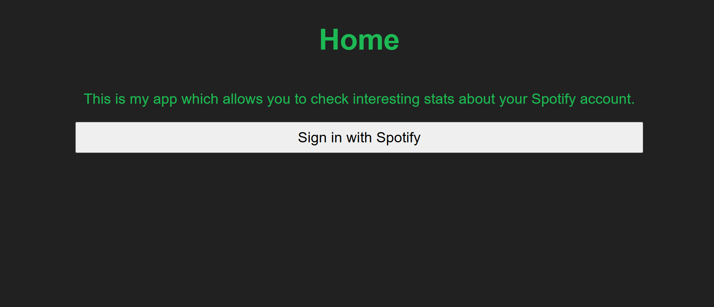
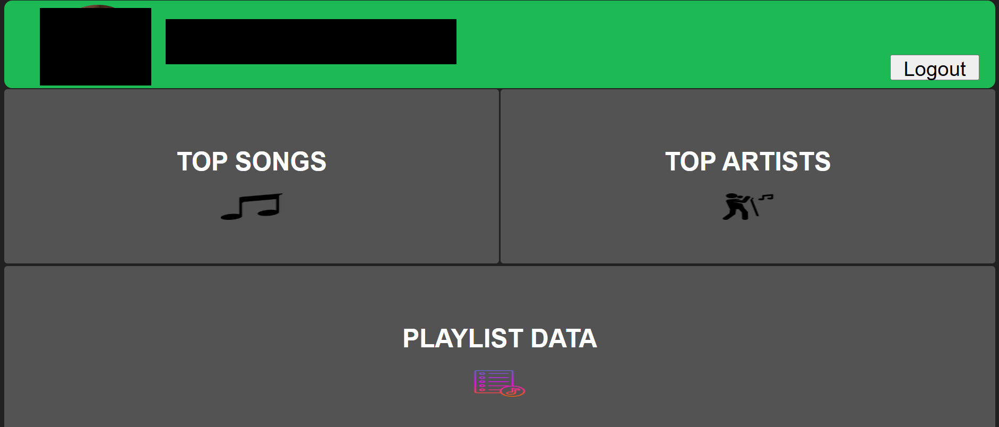
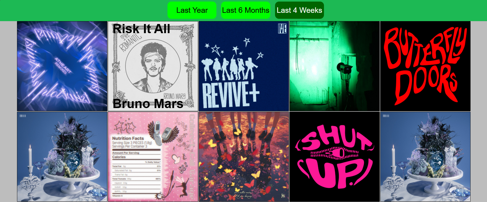
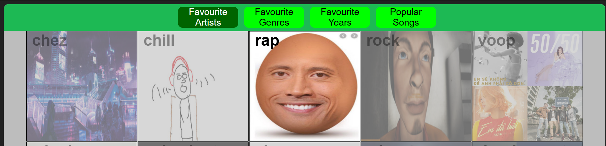
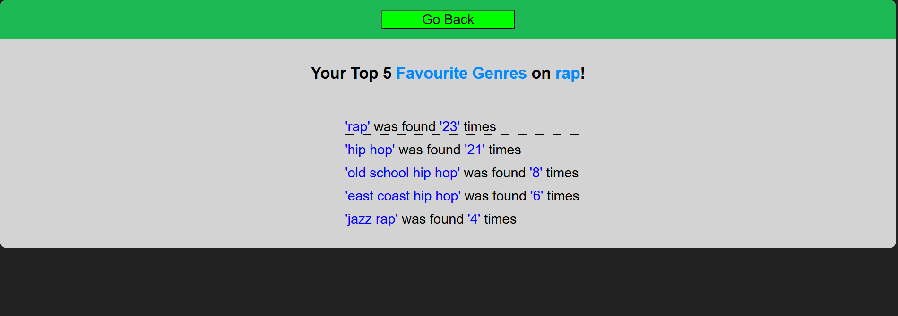

This is a React-Express application that retrieves data from your Spotify account using the [Spotify Web API](https://developer.spotify.com/documentation/web-api). It also optionally uses MongoDB to temporarily cache (10 minutes) data from previous API calls to minimise excess calls to the Spotify Web API.\
The data retrieved includes:
- Top listened to artists from your last year, 6 months, or 4 weeks.
- Top listened to songs from your last year, 6 months, or 4 weeks.
- Given a playlist that you created, your top 5 artists, genres, or song release years featured in the playlist.
- Given a playlist that you created, the top 10 most 'popular' (based on Spotify metrics) songs featured in the playlist.

To run, simply use Docker with 'docker compose up --build' in the root directory.

You will need 2 '.env' files, one in the './backend' and the other in './frontend' (Template env files provided).

The backend .env file should contain:
```
PORT=*YOUR BACKEND PORT HERE*
PORT_FRONT=*YOUR FRONTEND PORT HERE*
FRONTEND_URL=*YOUR FRONTEND URL HERE (INCLUDE HTTP/HTTPS)*

CLIENT_ID=*SPOTIFY APP CLIENT ID*
SECRET_ID=*SPOTIFY APP SECRET ID*

STATE=*ANY STRING*

MONGO_DB=*NAME OF YOUR MONGODB DB* # This is an optional field

SALT_PATTERN=*STRING OR INT*
```

The frontend .env file should contain:
```
PORT=*YOUR FRONTEND PORT HERE*
VITE_PORT_BACK=*YOUR BACKEND PORT HERE*
```

## Example Images:
### Home:


### Dashboard:


### Top Songs:


### Playlists Stats Page:


### Top Genres of Particular Playlist:
